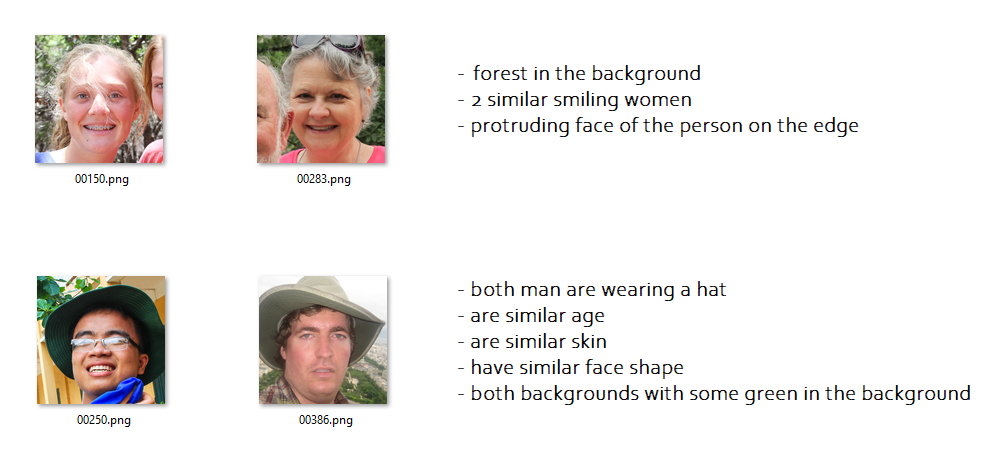
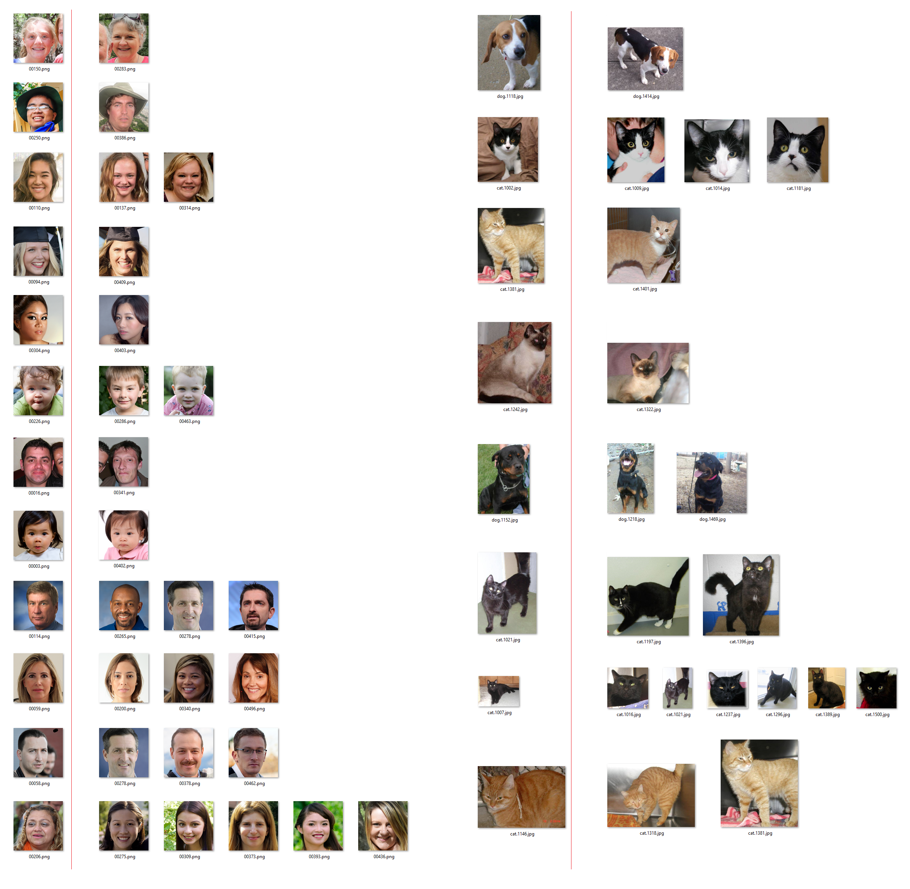

# Image data cleaning with pytorch (GPU)

I created this small tool to clean a dataset from redundant images. It was no trivial process as redundant images often are not similar. F.e. they can have just a little different brightness, they can be cropped, mirrored etc.

This tool processes all images in a given directory by any choosen pretrained model (I used resnet50) with the last layer cut out, to get latent vector. Then the tool uses the latent vecotr to compare image similarity (cosine_similarity between vectors).

The vector comparison process is n^2, because every image vector must be compared with each other. (There are algorithms for multi dimensional sorting, but I didn't have as many data, to struggle with that)
I used it for 7k images and it took 2-3h. 
For 1k images it takes 1-2min to process the data.

# Examples

Below dataset contained 1500 samples - it was mixed with images of 500 cats, 500 dogs, 500 faces.

Below examples are run with treshold 0.85, as the example dataset has no redundant images (values 0.9 or higher usally mean the sample is redundant or very similar)

More examples:

Note: As can be seen, the algorithm did not consider in above cases different classes (face - dog, dog - cat etc) as similar.